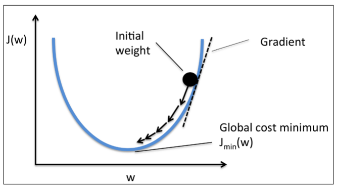
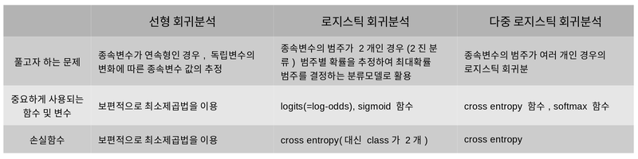

# 목차
- [회귀란?](#회귀란?)
- [선형](#선형)
- [로지스틱](#로지스틱)
- [softmax and cross entropy](#softmax-and-cross-entropy)
- [정리 및 요약](#정리-및-요약)
# 회귀란?
## 회귀분석이란?(Regression)
- 전통적인 분석 방법
- 연속형 변수 데이터 -> 관계 모델링 -> 적합도 측정
- 독립변수(설명변수)와 종속변수(반응변수)간의 관계 규명
## 선형 회귀 분석의 기본 가정
1. 선형성
2. 독립성
3. 등분산성
4. 정규성
- 관련 [링크](https://kkokkilkon.tistory.com/175)
## 분류와 회귀
|종류|내용|
|:---:|---|
|분류|x의 여러 feature를 이용 -> 클래스를 추론|
|회귀|x의 여러 feature를 이용 -> 정확한 값 추론|
# 선형
- 단순 선형 회귀: 한개의 독립 변수
- 다중 선형 회귀: 두개 이상
## 선형 회귀 모델링
- y = bx + e

|값|뜻|
|--|--|
|b|**회귀 계수**|
|e|**오차**|
|x|입력값|
|y|추론값|
- b와 e는 파라미터가 됨
- 주어진 데이터에 맞게 회귀계수와 오차를 구하는 것이 목표 
## 머신러닝에서 표기법
- H = Wx + b

|값|뜻|
|--|--|
|H|가정(Hypothesis)|
|W|가중치(Weight)|
|b|편향(bias)|
- b == W: 회귀계수
- e == b: 에러
## 용어 설명
### 잔차(Residuals)
- 추정된 값과 실제 데이터의 차이
- 잔차를 구하는 방법
> - 최소제곱법
>   - 모든 변수의 잔차의 제곱의 합
>   - 손실 함수로 사용됨
### 결정 계수(R^2)
- 1에 가까우면 좋음
## 코드
- [예시 코드로](./code.ipynb)
## 경사 하강법(Gradient Descent)

- W = W - a * W 미분
- a는 학습률
# 로지스틱
## 로지스틱 회귀 분석(Logistic Regression)
- Y값을 0과 1로 고정시킴
- 이진 분류에 특화
## 정의
### Log-odds
[설명 링크](https://towardsdatascience.com/https-towardsdatascience-com-what-and-why-of-log-odds-64ba988bf704)

> 1. 실 데이터를 Odd 및 회귀 계수 도출
> 2. 계산 값을 sigmoid에 입력함
> 3. threshold에 맞춰 2진 분류함
### 실제 코드
[코드](./code.ipynb)
## 로지스틱 회귀는 회귀인가 분류인가?
- 회귀 모델이다!
- 각 클래스일 확률(수치형)을 예측하는 것
# softmax and cross entropy
## softmax
- 여러 범주로 분류할 수 있도록함!
- 각 범주의 확률을 모아서 확률을 구함..
## cross entropy
- 잘 정리된 [사이트](https://hyunw.kim/blog/2017/10/26/Cross_Entropy.html)

# 정리 및 요약
