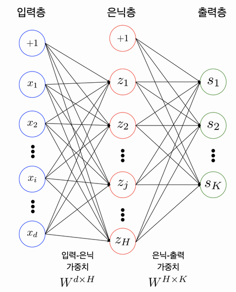
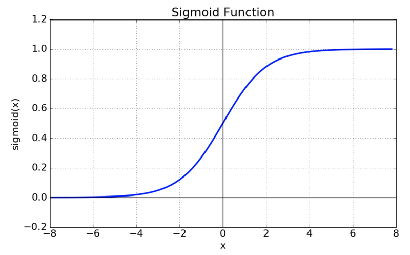
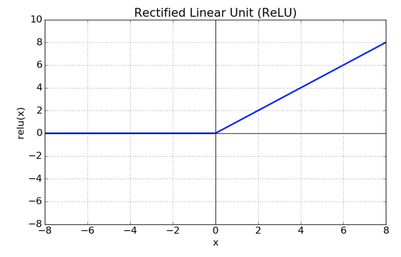
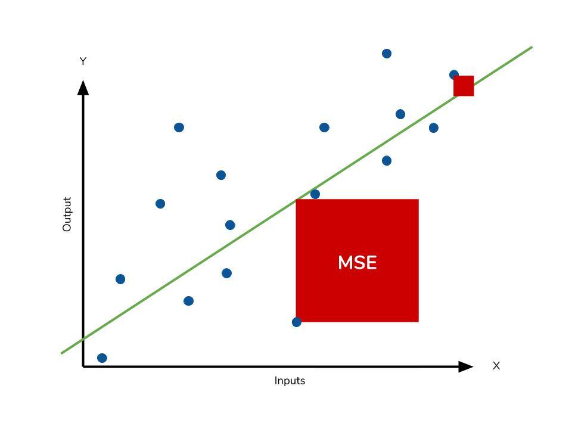
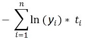
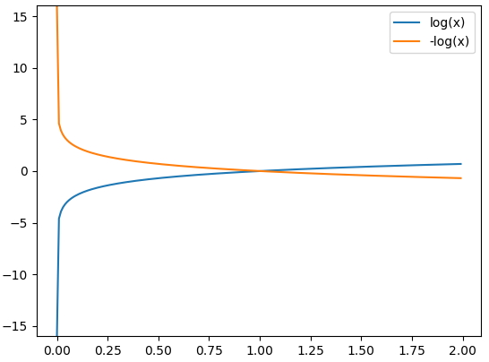

# 목차
1. [들어가며](#들어가며)
2. [신경망 구성](#신경망-구성)
3. [경사하강법](#경사하강법)
4. [오차역전파](#오차역전파)
5. [모델 학습](#모델-학습)
6. [추론 과정 및 정확도 계산](#추론-과정-및-정확도-계산)
7. [정리](#정리)
---
# 들어가며
## 학습 목표
- 딥러닝 문제 구성에 대한 기본적인 이해 상승
- Neural Network의 용어 이해
- numpy로 딥러닝 모델 및 훈련 구현
---
# 신경망 구성
## 개요
### 신경망(Neural Network) 이란?
- 뇌는 많은 뉴런들이 얽혀있음 -> 이것을 신경망이라고 부름
- 뉴런을 착안하여 퍼셉트론(Perceptron)을 제안 
> - 퍼셉트론이란?
- 이를 연결한 형태를 인공신경망(Artificial Neural Network;ANN)이라 부름
> - ANN VS DNN VS CNN VS RNN? 
### MNIST Revisited
- Tensorflow를 사용하여 구현한 분류 모델 [코드](./code.ipynb)
- Conv2D 대신 다층 퍼셉트론(Multi-Layer Perceptron;MLP)로 구현
- MLP == Fully-Connected Neural Network라고 부름
### 다층 퍼셉트론 Overview

- 은닉층```(H개)```, 출력층```(K개)```로 이루어진 인공신경망
- 맨 위에 +1은 바이어스를 나타냄
> - 바이어스란?
> - 바이어스와 관련한 [리뷰](https://stackoverflow.com/questions/2480650/what-is-the-role-of-the-bias-in-neural-networks)
- H == 50, K == 10, d == 784로 설정하고 진행함
- 여기서 은닉층이 상승하면(DEEP)해졌다 라고 할 수 있음
- DEEP == Deep Neural Network(DNN)과 동일함
### Parameters Weights
- 각 층간에는 행렬이 존재함
- 각 행렬은 Parameter(bias 포함) or Weight로 부름
- 위 내용들을 통해 [코드화](./code.ipynb)
## 활성화 함수와 손실 함수
### 활성화 함수(Activation Functions)
- MLP에서 활성화 함수는 필수
    - 수학적 이유
    - 활성화 함수(비선형 함수)가 존재하면 표현력이 좋아짐
        - 비선형 함수가 추가되지 않으면 한 개의 레이어와 수학적으로 다르지 않음
    - 관련 [링크](https://stackoverflow.com/questions/9782071/why-must-a-nonlinear-activation-function-be-used-in-a-backpropagation-neural-net/54503251#54503251)
### 활성화 함수의 종류
1. sigmoid

- 위 사진을 코드로 [구현](./code.ipynb)
- 함수의 문제점
    - exp 함수 사용시 비용이 크다
    - vanishing gradient 현상이 발생함
    > - vanishing gradient?
    > - 경사 소멸
    > - 관련 [정보 사이트](https://brunch.co.kr/@chris-song/39)
    > - 오류 역전파의 힘이 적어짐(0 ~ 1/4)
2. tanh

- 중심값을 변경(0으로)
- 최적화 느려지는 것을 막음
- vanishing gradient
3. ReLU

- sigmoid, tanh 함수에 비해 학습이 빠름
- 연산 비용이 크지 않고, 구현이 간단함
### 참고자료
- [링크1](https://reniew.github.io/12/)
- [링크2](https://pozalabs.github.io/Activation_Function/)
- [링크3](https://wikidocs.net/60683)
### 손실 함수(Loss Functions)
- 예측과 정답간의 차이를 계산해서 전체적으로 학습을 진행
- 비용 함수(Cost Functions)라고 부르기도 함
### 손실 함수의 종류
1. 평균제곱오차(Mean Square Error;MSE)

    $ MSE = \frac{1}{n}\sum_{i=1}^n(Y_{i} - \hat{Y}_{i})^2 $
- 실제값 - 예측값
2. 교차 엔트로피(Cross Entropy)


- 나온 결과값을 이 함수로 통해 오류를 알아냄
---
# 경사하강법
## 어떻게 오차를 줄일 것인가?
- 빠르게 오차를 내려가야함..
- [관련 링크](https://angeloyeo.github.io/2020/08/16/gradient_descent.html)
- 간격은 어떻게 전해야하나?
    - [학습률](https://aileen93.tistory.com/71)!(learning rate)
- 처음에 좋은 위치에서 시작하고 싶은데...
    - 파라미터 [초기화](https://reniew.github.io/13/)

---
# 오차역전파
---
# 모델 학습
---
# 추론 과정 및 정확도 계산
---
# 정리