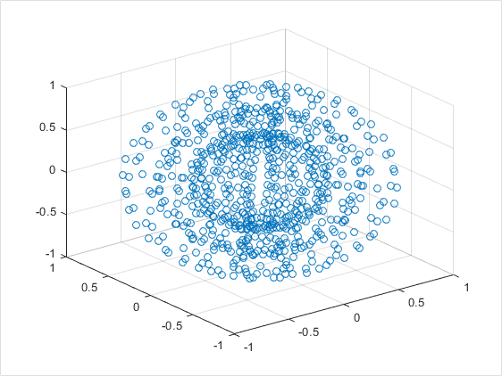
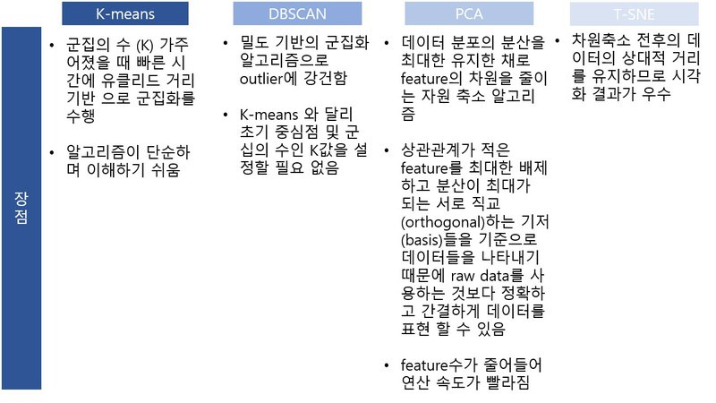

# 목차
- [비지도학습이란?](#비지도학습이란?)
- [K-means](#K-means)
- [DBSCAN](#DBSCAN)
- [PCA](#PCA)
- [T-SNE](#T-SNE)
- [정리](#정리)
# 비지도학습이란?
- 입력값(특징)만을 사용하여 데이터를 분류함
- 데이터셋에 라벨링을 하는 과정에서 인력자원이 많이 소모됨
- 위와 같은 문제점을 해결하기 위해 나타난 방법
## 종류
- 군집화(클러스터링, clustering)
- 차원 축소(dimensionality reduction)
- 생성 모델(generative model)
    - [설명 링크](https://minsuksung-ai.tistory.com/12)
- etc
# K-means
- k 개의 클러스터로 묶는 대표적인 알고리즘
## 동작 방식
1. 클러스터 수 결정
2. 무작위로 중심점 생성
3. 점들과 중심점간 거리를 계산하고 가장 가까운 중심점으로 속합니다
4. 클러스터된 점을 기준으로 중심점을 재조정합니다
5. 3 ~ 4를 반복함
## 문제점
### 데이터의 형태
- 대각선으로 연결된 데이터
- 반원형으로 연결된 데이터
- 동심원이 있는 데이터
### 다른 문제점
- 미리 군집의 갯수를 알 수 없음
- 데이터 분포에 따라 접근하기 때문에 위 데이터는 해결하기 어려움
- 군집 개수를 알아서 하면 좋겠다..
# DBSCAN
- Density Based Spatial Clustering of Applications with Noise
- 군집의 개수를 몰라도 됨
- 불특정 형태 군집 가능
- [시각적으로 동작 원리 확인](http://primo.ai/index.php?title=Density-Based_Spatial_Clustering_of_Applications_with_Noise_(DBSCAN))
## 변수
|변수명|내용|
|:-:|-|
|epsilon|반경|
|minPts|최소값|
|core point|반경안에 최소값 이상 점이 존재하는 중심점|
|border point|중심이 아니지만, 군집에 속한 값|
|noise point|군집에 포함되지 못한 값|
## 동작 방식
1. 임의 점 p 설정 반경내 점의 갯수를 셈
2. 갯수가 최소값을 넘으면 core point로 설정
3. 최소값을 넘지 못하면 pass
4. 모든 점이 다음 과정을 겪음, 각 클러스터가 연결되면 합쳐줌
5. 클러스터에 속하지 못한 점은 noise로 간주함
## 문제점
- 데이터 수가 많으면 많을수록 시간이 오래 걸림
- 순회하는 시간을 고려해야함
# PCA
- 많은 데이터 중 알맞은 정보를 뽑아 내는 것은 어려움
- 여러 특징 중 중요한 정보를 표현해야함
## PCA 원리
- 데이터의 분산이 가장 큰 방향 벡터..?
- 분산을 최대로 보존하면서 직교하는 기저들을 찾아 사영(projection)함
- 기존 feature를 선형 결합함..
- 즉 분산이 적은(의미가 적은) 데이터를 선형결합으로 결합함
-주성분 데이터를 2개로 압축하는 것이 기본 데이터 30개를 쓰는 것 보다 효과적임
## 주의할 점
- 주로 행하는 방법이 선형 결합함으로 데이터가 수치 데이터야함..

- 데이터의 분산이 크지 않은 경우 알맞게 나타내기 어려움
# T-SNE
- 기존 차원의 가까운 점을 차원 축소시 유지함
## 주의할 점
- 데이터가 어떠한 물리적인 값을 나타내지 않음
- 그저 시각화에 좋은 결과를 나타냄
# 정리
